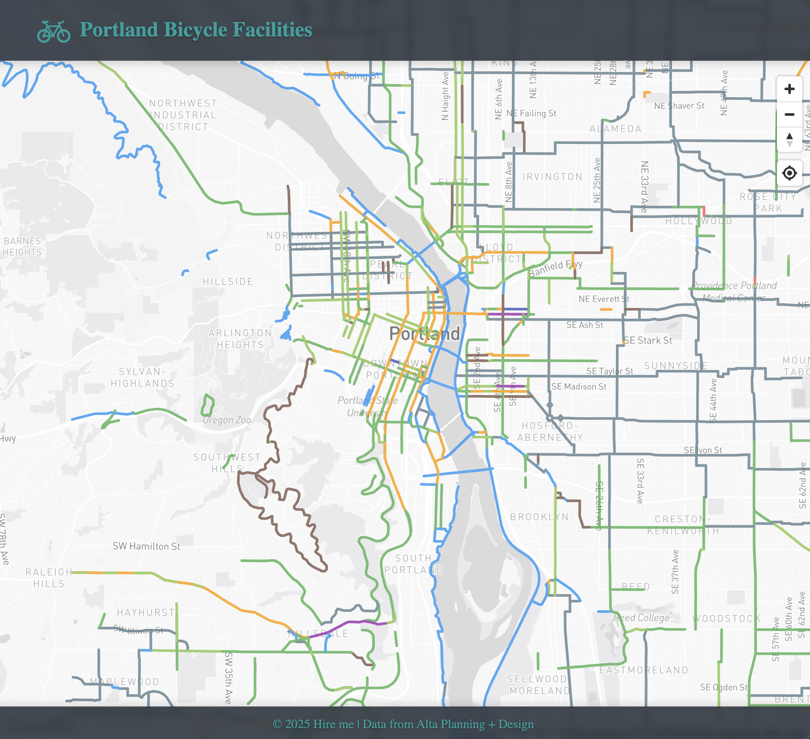

# Alta Technical Assessment: Bike Facilities

install the project via github:

```sh
git clone https://github.com/devsweeting/alta-project.git
```



## Run on Docker

In your terminal navigate to this project folder. and build the docker image using:

```sh
docker build -t alta-project .
```

Once the image is built run the image locally using:

```sh
docker run -p 4321:4321 alta-project
```

You can then view this project at:

```
  local: http://localhost:4321
  network: http://172.17.0.2:4321
```

## 🚀 Project Structure

Inside this project, you'll see the following folders and files:

```text
/
├── public/
│   └── favicon.svg
├── src/
│   ├── assets/
│   │   └── images
│   ├── components/
│   │   └── Map.astro
│   ├── data/
│   │   └── bike-facilities.geojson
│   ├── layouts/
│   │   └── Layout.astro
│   └── pages/
│       └── index.astro
└── package.json
└── dockerfile
```

## 🧞 Technology Used

---

- [Astro](https://docs.astro.build)
- [MapBox GL JS](https://docs.mapbox.com/mapbox-gl-js/guides)
- [Astro Docker Instructions](https://docs.astro.build/en/recipes/docker/)

## 🧞 Commands

All commands are run from the root of the project, from a terminal:

| Command                   | Action                                           |
| :------------------------ | :----------------------------------------------- |
| `npm install`             | Installs dependencies                            |
| `npm run dev`             | Starts local dev server at `localhost:4321`      |
| `npm run build`           | Build your production site to `./dist/`          |
| `npm run preview`         | Preview your build locally, before deploying     |
| `npm run astro ...`       | Run CLI commands like `astro add`, `astro check` |
| `npm run astro -- --help` | Get help using the Astro CLI                     |

## 👀 The "Nice-to-haves"

- Map Legend
- Bike route navigation to estination
